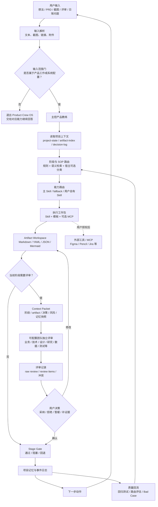

# Product Crew OS

[](releases/v0.1.3.md)
[](LICENSE)
[](product-crew-os-skill/references/workflow-sop-library.md)
[](product-crew-os-skill/references/bundled-skill-index.md)

一间给产品经理用的 AI 产品办公室。

Product Crew OS 不把产品工作变成一群 Agent 聊天。用户只和一个主控产品教练对话；主控负责判断当前阶段、命中 SOP、调用能力、安排必要评审，并把结果沉淀成可继续编辑的项目文件。

它解决的不是“AI 能不能写文档”，而是产品经理在 0-1 推进时常遇到的事：不知道下一步该做什么、需求没有被充分反驳、决策和评审无法追溯、做完的项目经验无法复用。

```text
Workflow + Skill + Review + Artifact Workspace
```

## 开始使用

直接把真实工作交给它：

```text
我有一个产品想法，先帮我判断值不值得做。
```

```text
我写完 PRD 了，帮我做一次内审。
```

```text
客户提了一个需求，帮我判断是真需求还是伪需求。
```

它会告诉你：现在在哪个阶段、该产出什么、需要谁来评审、下一步由谁确认。

## 你会得到什么

| 场景 | 结果 |
| --- | --- |
| 只有想法 | 问题定义、机会判断、验证计划 |
| 需求很乱 | 证据清单、真伪需求判断、调研计划 |
| 开始做方案 | MVP 范围、方案对比、流程图、原型 brief |
| 写 PRD | PRD 草稿、自审、评审记录 |
| 交付研发 | 任务拆解、验收标准、测试场景 |
| 上线和复盘 | 上线清单、监控指标、复盘和下一版计划 |
| 项目沉淀 | 项目首页、决策、风险、评审项和 Markdown 项目包 |

## 它怎么工作

用户看见的是当前状态和下一步；后台则保留路由、评审、产物、Gate 和记忆记录。



## 可配置团队与评审

默认体验只有主控教练在前台。业务、技术、设计、数据、测试、法务、运营等角色只在阶段门或评审需要时进场。

正式评审必须围绕一个明确的 artifact：

```text
锁定 artifact 版本
-> 生成完整 Context Packet
-> 角色独立评审
-> 写 raw review / review items / conflict
-> 主控收束问题
-> 用户决定采纳、拒绝、暂缓或补证据
-> 修改 artifact
-> 相关角色复评
-> 用户确认后关闭评审
```

子 Agent 只能给意见，不能替用户做最终决定。真实调用需要完整 Persona Context Packet、运行 ID 和原始评审记录；缺失时必须标为 `simulated` 或 `runtime_blocked`，不能作为 Gate 依据。

## 项目资产与记忆隔离

项目不是一段聊天记录，而是一套可回溯的资产：

```text
project-state.json      当前阶段、Gate、版本和下一步
artifact-index.yaml     产物索引
decision-log.md         采纳、拒绝和延期的原因
review-items.yaml       评审项和状态
raw-review-records/     角色原始评审
risk-log.md             风险、阻塞和依赖
agent-memory/           当前项目内的角色记忆摘要
```

Project Workspace 是项目事实源。Obsidian、Word、PDF、Notion、飞书等只是导出或镜像；Obsidian 不是必装依赖。


公共产品规则、用户偏好和项目材料必须隔离。项目材料不能写入开源规则包；真实同事邮件、会议纪要或语气素材没有用户授权，不能进入长期记忆。

## 已包含的能力

- 44 个 SOP 卡片、路由和最小 Runtime 链路。
- 49 个随包 PM Skill，以及用户自有 Skill 覆盖入口。
- SQLite Runtime：记录项目、产物版本、决策、评审、调用台账和 Gate。
- Artifact Workspace：输出 Markdown、YAML、JSON 等可追溯文件。
- 本地文本、图片和截图资料接入；PaddleOCR 为主路径，Tesseract 为 fallback。
- 本地质量测试：包校验、路由、Runtime、SOP、评审循环、Bad Case 和资料接入。

## 真实边界

- 非产品任务不会被强行归到 SOP、Skill Router、项目记忆或评审流程；它会退出 Product Crew OS，交给对应能力正常回答。
- 44 个 SOP 都有卡片、路由和最小测试链路；不等于每个 SOP 都完成了深度真实业务验证。
- Skill 被路由到不等于已经真实执行。只有宿主返回执行证据，才能作为 Gate 依据。
- 子 Agent 是否能真实调用取决于宿主的 delegation 能力；不支持时不能假装已调用。
- OCR、Embedding、向量库和外部 MCP 都依赖本地环境。依赖缺失时必须明确显示受限状态。
- 低置信 OCR、未授权或未索引来源可以作为参考，但不能作为最终 Gate 证据。

## 安装与验证

### Codex

复制完整 `product-crew-os-skill/` 到：

```text
~/.codex/skills/product-crew-os/
```

不要只复制 `SKILL.md`；`config/`、`references/`、`templates/`、`tests/` 和 `third_party/skills/` 都是能力的一部分。

### 本地验证

在仓库根目录运行：

```text
ruby product-crew-os-skill/tests/validate-package.rb
ruby product-crew-os-skill/tests/run-regression.rb
ruby product-crew-os-skill/tests/run-runtime-smoke.rb
ruby product-crew-os-skill/tests/run-sop-e2e-smoke.rb
ruby product-crew-os-skill/tests/run-review-loop-e2e.rb
ruby product-crew-os-skill/tests/run-loop-50-cases.rb --release-gate
ruby product-crew-os-skill/tests/run-source-ingestion-runtime.rb
```

测试验证本地规则、路由、运行时写入和门禁，不代表线上用户效果。

## 关键文档

- [Skill 入口](product-crew-os-skill/SKILL.md)
- [44 SOP 库](product-crew-os-skill/references/workflow-sop-library.md)
- [Skill 索引](product-crew-os-skill/references/bundled-skill-index.md)
- [状态机与实现边界](product-crew-os-skill/references/workflow-implementation-coverage-v0.md)
- [子 Agent 调用契约](product-crew-os-skill/references/subagent-invocation-contract.md)
- [Runtime 使用说明](product-crew-os-skill/runtime/README.md)
- [LangGraph 控制平面](product-crew-os-skill/references/langgraph-runtime-architecture.md)
- [v0.1.4 发布说明](releases/v0.1.4.md)

## 许可证

Product Crew OS 自有规则、模板、配置和测试按 [MIT License](LICENSE) 授权。

`product-crew-os-skill/third_party/skills/` 下的第三方 Skill 保留各自许可证；请查看 [THIRD_PARTY_NOTICES.md](product-crew-os-skill/THIRD_PARTY_NOTICES.md)。
