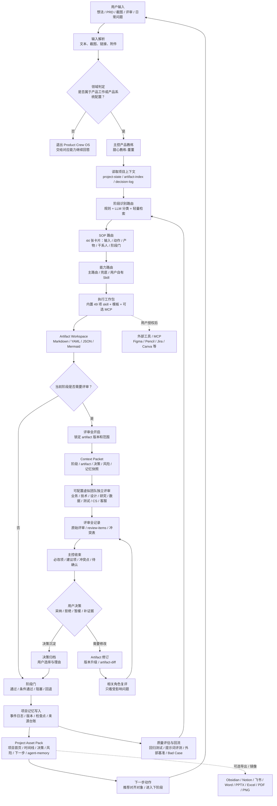
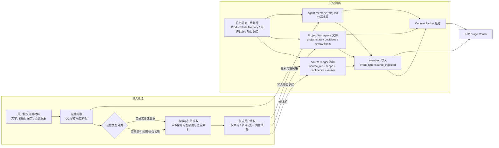

# Product Crew OS

[](releases/v0.1.2.md)
[](LICENSE)
[](README.md)
[](product-crew-os-skill/tests)
[](product-crew-os-skill/SKILL.md)
[](product-crew-os-skill/references/bundled-skill-index.md)
[](#多平台使用)
[](#多平台使用)

一间给产品经理用的 AI 产品办公室。

Product Crew OS 让你主要和一个主控产品教练对话。主控教练会判断你当前处在哪个产品阶段，调用合适的 skill，在关键节点召唤可配置的同事角色参与评审，并把讨论结果沉淀成可继续编辑的产品产物。

它解决的不是“AI 能不能写文档”，而是产品经理在 0-1 推进里最痛的几件事：不知道下一步该做什么，没人像资深 PM 一样带着拆问题，缺少真实团队视角来提前反驳，文档做到什么标准心里没底，做过的项目经验也很难复用。

它的目标不是制造一个热闹的多 Agent 群聊，而是给产品经理提供一套温暖、主动、可持续的全流程产品工作系统：从想法判断、需求验证、方案设计、PRD、评审、任务拆解，到验收、上线和复盘，都有人带你往前走。

你也可以自由定制这支 AI 产品团队：主控教练叫什么、说话风格如何；技术、业务、设计、测试、客户成功等角色是什么性格、严不严格、像不像你真实公司的同事，都可以按你的工作习惯调整。

发布包已内置 49 个第三方 PM skill / 工作包，覆盖路由里大多数产品阶段。新用户不需要先手动安装一堆 skill 才能跑起来；后续也可以用自己的团队模板、公司规范或其他开源 skill 覆盖默认实现。

```text
Workflow + Skill + Review + Artifact Workspace
```

## Start Here

你不需要先记命令。直接把真实工作丢进来：

```text
我有一个产品想法，帮我判断值不值得做。
```

```text
我写完 PRD 了，帮我做一次内审。
```

```text
客户提了一个需求，帮我判断这是真需求还是伪需求。
```

Product Crew OS 会回答三件事：

1. 你现在处在哪个产品阶段。
2. 下一步应该产出什么 artifact。
3. 需要找谁对齐，是否要召唤业务、技术、设计、数据、测试、法务、运营、CS 或客户代表评审。

Product Crew OS 只在产品工作或产品系统配置相关请求里接管流程。普通翻译、闲聊、通用代码问题、生活问答等非产品任务，不会被强行归到 SOP、Skill Router 或 Stage Gate。

默认情况下，阶段 SOP 会优先调用随包内置的 PM skill；如果你有自己的 skill 或公司 SOP，也可以作为 overlay 接管对应阶段。

当前路由门禁不再把 `artifact-template` 当成普通成功路径。每次 44 SOP 回归会记录 `expected_primary_skill`、实际路由 skill、最终 selected skill、`skill_status` 和 `degrade_reason`；如果只能退到 template，会被标记为 degraded，而不是算作 skill 正常命中。

Embedding / RAG 目前是可选增强，不是默认发布门禁的真实外部依赖。发布包先内置 `pco_rules` 公共规则索引契约、dry-run runner 和 ingestion contract，用来验证 44 SOP、stage taxonomy、skill router 和角色边界是否能被检索；真实项目材料、用户偏好和团队风格必须经用户授权后才可进入独立 namespace。

RAG ingestion 采用本地优先方案：截图和图片先走 OCR，默认主路径为 PaddleOCR，Tesseract 作为轻量 fallback；文本材料按 Markdown heading、YAML/JSON path、表格、段落和句子做语义结构化切分，并保留 overlap；默认开源 embedding 模型为 `BAAI/bge-small-zh-v1.5`，批处理写入 SQLite + `sqlite-vec` + FTS5。每条 chunk 都带 `source_ref`、`content_hash`、`consent_ref`、`pii_level`、OCR 置信度和 artifact version，方便增量更新、清理维护和召回/准确率监控。首轮路由采用 Input Scope Gate：硬性非产品任务直接退出，其他模糊输入允许规则/别名和公共 `pco_rules` 检索并行辅助命中 44 SOP；项目、用户偏好和团队风格私有库仍需授权后才能检索。

## 适合谁

- 刚入行或正在成长的产品经理。
- 想拥有专属 AI 产品团队的产品经理。
- 希望把产品流程、评审标准和项目记忆沉淀成可复用工作系统的人。

## 你会得到什么

| 场景 | Product Crew OS 会帮你推进到 |
| --- | --- |
| 只有一个想法 | 商业判断、问题定义、验证计划 |
| 需求很乱 | 真伪需求判断、证据盘点、调研问题 |
| 要开始做方案 | MVP 范围、一页方案、流程图、低保真原型 brief |
| 要写 PRD | PRD 草稿、产品自审、正式评审记录 |
| 要交付研发 | Epic / Story / Task、验收标准、测试场景 |
| 要上线 | 上线清单、灰度试点、运营培训、复盘记录 |
| 要沉淀项目资产 | Project Asset Pack、时间线、决策日志、评审项、Markdown 项目包 |

## 可召唤的产品团队

Product Crew OS 的团队成员是可配置的子 Agent，但它们不会常驻在前台抢话。

默认体验是：你主要和主控教练对话。主控教练会在需要真实评审的时候，按当前阶段短暂召唤对应团队成员，例如：

- 商业论证时，召唤业务负责人、数据负责人或客户代表，判断值不值得做。
- 需求验证时，召唤用户调研、CS 或客户代表，判断是真需求还是伪需求。
- 方案设计时，召唤技术负责人、产品设计和测试负责人，提前暴露实现风险和体验断点。
- PRD 评审时，召唤业务、技术、设计、测试、数据等角色，形成 review items、decision log 和下一步动作。

每个团队成员都可以绑定自己的角色边界、说话风格和性格参数。你可以把他们调成“谨慎的架构师”“很直接的业务负责人”“特别难缠的客户代表”，也可以逐步用真实项目里的邮件、会议纪要和同事反馈，在用户授权后反哺角色风格。

主控教练负责收束分歧：子 Agent 给意见，主控教练做汇总、提醒冲突、推动决策，并把结果写回 Artifact Workspace。

真实子 Agent 调用取决于运行环境是否支持 delegation。如果当前环境不支持真实调用，主控教练必须明确标注为“模拟角色视角”，不能声称已经拉起真实子 Agent。

### 借鉴对照（非复制）

发布包内置 `references/github-benchmarked-patterns.md`，给出和我们产品结构相近的开源项目中可复用的实现机制。

- 不照抄 UI 或流程细节。
- 只借鉴三类可验证机制：
  - SOP/阶段状态边界是否稳定。
  - Review Loop 是否能显式记录冲突、阻塞、回路和用户确认。
  - Router / Skill / 可观测事件是否能被回归测试覆盖。
- 复用规则是“可验证机制优先”，让每次升级只改一层：先加日志和判定，再加自动化。
- 对照入口见 [github-benchmarked-patterns.md](product-crew-os-skill/references/github-benchmarked-patterns.md)。

子 Agent 评审有明确运行边界：默认每个角色每轮最多等待 120 秒。超时不会被当成完成评审，必须写入 invocation ledger；如果该角色是阶段门必需角色，评审会进入阻塞状态，由用户选择继续等待、分批补评，或基于已有意见先推进。

## 项目资产包

Product Crew OS 会把从 0 到 1 推进过程中已经收束的关键产物沉淀为 Project Asset Pack。它不是全量聊天记录，而是项目级知识库：

- `project-state.json`：当前阶段、gate、artifact 版本、下一步。
- `artifact-index.yaml`：项目产物索引。
- `timeline.md`：关键推进节点。
- `decision-log.md`：采纳、拒绝、延期的决策。
- `review-sessions/`：每次结构化评审的对象、版本、角色和状态。
- `raw-review-records/`：每个角色的原始评审记录。
- `review-items.yaml`：子 Agent 和干系人评审项。
- `risk-log.md`：风险、阻塞和依赖。
- `next-actions.md`：下一步动作。
- `agent-memory/`：角色在当前项目中的记忆摘要。

Project Workspace 是唯一事实源。Markdown 项目包、Word、Excel、PPTX、PDF、PNG、Obsidian-compatible Vault、Logseq、Foam、Dendron、VS Code、Typora、Notion 或飞书文档都是导出或镜像，不会替代运行时状态。

Obsidian 不是必装依赖。未安装 Obsidian 时，用户仍可获得通用 Markdown 项目包；安装后可把导出目录作为 Vault 打开。

为了让用户真的能读懂项目推进过程，Obsidian / Markdown 项目包按 10 大产品流程组织：机会发现、用户研究、问题定义、需求分析、方案设计、PRD 与评审、交付规划、上线准备、上线监控、复盘迭代。44 个 SOP 不作为用户可见一级目录，而是写入每个 artifact 的 `sop_id`、索引和事件日志；决策、风险、评审项、下一步和来源台账统一放入 `_项目账本/`，方便后续回溯和检索。

笔记工具适配不应写死为 Obsidian。Product Crew OS 把笔记工具抽象为 `note_adapter`，用户可以自行选择 Obsidian、Logseq、Foam、Dendron、VS Code、Typora 或通用 Markdown 文件夹。可复制的适配提示词见 [Host + Note Adapter Prompt](product-crew-os-skill/templates/adapters/host-note-adapter-prompt.md)。

## 它怎么工作

Product Crew OS 现在把“用户看到的推进状态”和“系统后台状态机”分开：

- 普通用户看状态卡：现在判断什么、交付什么、不承诺什么、关键风险、谁把关、需要拍什么板、如何纠偏。
- 开发者、测试和审计者看状态机：Input Scope Gate（兼容旧图里的 Domain Gate）、Stage Router、SOP Composer、Skill Router、Artifact、Review Loop、Gate、Project Memory。
- 可视化入口：[状态机规则](product-crew-os-skill/references/workflow-state-machine.md)、[HTML 状态机 Demo](docs/state-machine/workflow-state-machine-demo.html)、[Obsidian Mermaid 示例](examples/obsidian/workflow-state-machine-v1.md)。
- Golden Case / 主流程编排文件仅作为实验审计记录，不作为当前主线 release gate。
- 当前主线门禁回到 44 个 SOP：Stage / SOP 命中、Skill 命中、runtime 写入、artifact 输出、context packet、invocation ledger 和 review item 可追踪。
- 实现覆盖边界：[workflow-implementation-coverage-v0.md](product-crew-os-skill/references/workflow-implementation-coverage-v0.md)。当前不能宣称 10 个主流程和 44 个 SOP 都有完整状态机 Golden Case。



说明：主流程图只画每次会话推进链路。记忆反哺不在这里展开；相关规则和隔离策略见下文第二张图。



说明（回应你这句问题）：
- 同事邮件截图这类“外部人物口吻素材”不应写进当前会话主上下文。
- 它首先进入“证据入口”，沉淀 `source_ref` 到 `source-ledger`，同时落地到 `project-state / decisions / review-items` 的追溯链条。
- 如果用户授权，再按角色偏好抽取“语气、风格、常见卡点”写入 `agent-memory/{role}.md`；未授权只做本轮参考，不写长期风格记忆。

这套流程的重点不是“多 Agent 一起聊天”，而是主控教练负责把工作推进成闭环：

```text
用户输入
-> 判断是否进入产品流程
-> 判断 Stage
-> 调用 SOP / Skill / 模板
-> 必要时召唤团队角色
-> 生成或修改 Artifact
-> 过 Stage Gate
-> 写入项目资产包和团队记忆
-> 进入下一步
```

如果用户只是让系统“移动任务”“翻译一句话”“改普通日报”，Product Crew OS 不会强行套 44 个产品 SOP；只有当请求确实属于产品工作或产品系统配置时，才会进入 Stage Router 和 Skill Router。

## 结构化评审闭环

Product Crew OS 的子 Agent 评审不是让几个角色在聊天里热闹几句。正式评审必须围绕一个明确 artifact 运行，并沉淀成用户可检查的记录。

```text
创建 Review Session
-> 锁定 artifact 版本
-> 按角色生成 Context Packet
-> 角色独立评审
-> 写 raw review / review-items / conflict-matrix
-> 主控归纳 must-fix、should-fix、冲突点和待确认
-> 用户决定采纳、拒绝、暂缓或补证据
-> 修改 artifact 并生成 artifact-diff
-> 只让相关角色复评
-> 用户确认后关闭评审
```

主控教练可以建议下一步，但不能替用户决定采纳或拒绝，也不能把仍未解决的 `block` 擅自改成 `pass`。完整规则见 [Structured review loop](product-crew-os-skill/references/structured-review-loop.md)。

## 团队记忆如何判断成功

团队记忆不是看底层子 Agent 聊天窗口有没有自己记住历史。Product Crew OS 的长期记忆由 Project Workspace 管理，主控教练在每次召唤角色前负责读取、压缩、注入和回写。

一次合格的带记忆评审，应该能被这样检查：

```text
读取 crew persona / user overlay / project agent-memory
-> 生成 memory_snapshot
-> 注入 agent-context-packet
-> 子 Agent 只能引用 packet 中存在的信息
-> 评审意见转成 review item / decision / artifact 修改
-> 生成 memory_delta
-> 写回 Project Workspace，并带 source_ref / scope / confidence
```

可观测指标包括：

- `context_packet_injection_rate`：召唤前是否注入完整上下文。
- `role_memory_recall_rate`：角色是否正确引用历史关注点和上次卡点。
- `memory_delta_writeback_rate`：评审后是否形成可复用记忆增量。
- `memory_source_traceability_rate`：每条记忆是否能追溯来源。
- `memory_scope_isolation_rate`：项目记忆、用户偏好、产品规则是否隔离。
- `team_style_consent_rate`：真实同事语气、邮件、会议材料是否授权后才保存。

本地回归里已经包含 `subagent-memory-runtime`、`memory-resume-after-context-loss`、`project-asset-pack-persistence` 和 `team-style-overlay-consent` 等场景，用来验证团队记忆链路不会只停留在口头描述。

默认主控教练是 **甜心教练-董董**：魅力型领袖，思虑周全，亲和力拉满。这个名字和性格只是预设，用户可以改。

默认团队角色包括：

| 角色 | 默认昵称 | 主要负责 |
| --- | --- | --- |
| 业务负责人 | 包总 | 商业目标、优先级、资源冲突 |
| 技术负责人 | 张工 | 可行性、依赖、范围、技术风险 |
| 产品设计 | 文设计 | 信息架构、流程、交互状态 |
| 用户调研 | 研希 | 证据、访谈、用户动机 |
| 客户成功 / CS | 阿笨 | 采纳、培训、客户反馈 |
| 客户代表 | 黑老板 | 外部诉求、验收压力、购买决策 |
| 数据负责人 | 陈数 | 指标、口径、埋点、数据可信度 |
| 测试负责人 | 李测 | 验收标准、边界条件、回归风险 |
| 法务合规 | 周律 | 授权、合规、外部触达边界 |
| 运营培训 | 洪运 | 上线 SOP、培训、试点执行 |

这些角色不是固定剧本。用户可以用自己的团队风格覆盖默认配置，比如“技术负责人更谨慎”“业务负责人更直接”“客户代表更难缠”。真实同事邮件、会议纪要或回复语气只有在用户授权后，才能进入项目或用户级记忆。

## 三种使用方式

| 模式 | 适合场景 | 示例 |
| --- | --- | --- |
| 单点能力调用 | 只想快速完成一个任务 | 帮我判断这个需求是真需求还是伪需求 |
| 完整工作流推进 | 从想法走到 PRD 或上线 | 帮我从一个想法走到可评审 PRD |
| 中途插入 | 项目已经进行中，某个点卡住 | 我 PRD 写一半了，帮我看缺什么 |

## 能力地图

| 分组 | 可以帮你做什么 |
| --- | --- |
| 项目接入 | 项目卡、当前阶段、下一步 |
| 商业与战略判断 | 商业论证、价值评估、优先级 |
| 需求发现与验证 | 真伪需求判断、证据盘点、调研计划 |
| 用户理解 | 用户分层、JTBD、旅程地图 |
| 方案设计 | 方案对比、MVP 范围、一页方案 |
| 流程与原型 | 流程图、低保真原型、HTML Demo、Pencil / Figma 承接 |
| 数据与指标 | 北极星指标、指标树、埋点计划 |
| PRD 与评审 | PRD 草稿、产品自审、正式评审 |
| 交付拆解 | Epic / Story / Task、验收标准、测试场景 |
| 上线与运营 | 上线清单、培训 SOP、灰度试点 |
| 复盘与迭代 | 上线监控、复盘、下一版 backlog |
| 项目资产沉淀 | 项目首页、时间线、决策日志、评审项、Markdown / Obsidian-compatible 导出 |

完整 SOP 见 [workflow-sop-library.md](product-crew-os-skill/references/workflow-sop-library.md)。
内置 skill 映射见 [bundled-skill-index.md](product-crew-os-skill/references/bundled-skill-index.md)。
44 个 SOP 的路由 / 技能 / 复测覆盖缺口清单见 [sop-coverage-gap.md](product-crew-os-skill/references/sop-coverage-gap.md)。
当前不再把主流程完整编排计数作为主线门禁；后续优先保证 44 个 SOP 都能正确命中、选择 skill、写入 runtime 和产出可追踪 artifact。
工作流完整实现边界见 [workflow-implementation-coverage-v0.md](product-crew-os-skill/references/workflow-implementation-coverage-v0.md)：它区分 SOP/Router、Runtime Smoke、Structured Review Loop 和完整状态机 Golden Case。

## 快速安装

### Codex

把完整的 `product-crew-os-skill/` 文件夹复制到 Codex skills 目录：

```text
~/.codex/skills/product-crew-os/
```

例如：

```bash
cp -R product-crew-os-skill ~/.codex/skills/product-crew-os
```

然后在 Codex 中调用：

```text
$product-crew-os
```

如果你的运行环境支持隐式 skill 调用，产品工作流相关请求也可以自动触发。

不要只复制 `SKILL.md`。`config/`、`references/`、`templates/`、`tests/` 和 `third_party/skills/` 都是产品能力的一部分。

`product-crew-os-skill/third_party/skills/` 已随包携带第三方 PM skill 实现。用户部署完整文件夹后，即可使用 Product Crew OS 的全流程内置能力，包括阶段判断、SOP、skill 路由、子 Agent 评审、Artifact Workspace 模板、回归测试和内置 PM skill pack。

外部系统写入类能力仍需要用户授权或安装对应插件，例如 Figma、Pencil、Jira、飞书、Notion、Canva 或其他 MCP 工具。没有外部授权时，Product Crew OS 会产出 Markdown、YAML、JSON、Mermaid、CSV 或可复制任务清单，保证产品流程不断。

## 本地 Runtime

Product Crew OS 现在包含一个最小本地 Runtime，用 SQLite + Project Workspace 文件把项目记忆落到真实数据层，而不是只停留在对话框里。

Runtime 能做：

- 初始化项目和 SQLite 数据库。
- 保存 artifact 与 artifact version。
- 写入 decision、review item、agent memory 和 memory delta。
- 构建子 Agent 用的 Context Packet。
- 记录真实或模拟子 Agent invocation ledger。
- 记录 Stage 命中、Skill 选择、团队记忆快照、子 Agent 召唤和 Stage Gate 等评估事件。
- 按 10 大产品流程导出 Obsidian-compatible Vault。

最小示例：

```text
ruby product-crew-os-skill/runtime/pco_runtime.rb init-project \
  --workspace ./runtime-workspace \
  --db ./runtime-workspace/product-crew-os.sqlite3 \
  --project-id demo \
  --name "Demo Project"

ruby product-crew-os-skill/runtime/pco_runtime.rb save-artifact \
  --workspace ./runtime-workspace \
  --db ./runtime-workspace/product-crew-os.sqlite3 \
  --project-id demo \
  --name "MVP Scope" \
  --stage-id requirement_analysis \
  --sop-id sop_16_mvp_scope \
  --content "MVP scope draft"

ruby product-crew-os-skill/runtime/pco_runtime.rb record-turn \
  --workspace ./runtime-workspace \
  --db ./runtime-workspace/product-crew-os.sqlite3 \
  --project-id demo \
  --stage-id mvp_scope \
  --macro-stage requirement_analysis \
  --sop-id mvp_scope \
  --user-input "先做 MVP，帮我砍范围" \
  --primary-skill scope-cutting \
  --fallback-skill shape-up \
  --artifact-name "mvp-scope.md" \
  --artifact-content "MVP scope draft from runtime adapter" \
  --review-roles "Biz,Tech,Design" \
  --gate-status conditional_pass \
  --gate-result "MVP can prove one core hypothesis"

ruby product-crew-os-skill/runtime/pco_runtime.rb export-obsidian \
  --workspace ./runtime-workspace \
  --db ./runtime-workspace/product-crew-os.sqlite3 \
  --project-id demo \
  --output-dir ./runtime-workspace/obsidian-vault
```

如果想一次性生成可检查的持久项目包：

```text
ruby product-crew-os-skill/runtime/create_demo_vault.rb \
  --output-dir ./runtime-demo-vault
```

输出目录会包含 SQLite 数据库、Project Workspace 和 Obsidian-compatible Vault，可直接用 Obsidian 打开 `runtime-demo-vault/obsidian-vault`。

这不是完整 SaaS 后端，但它已经把 M1 能力跑起来：SQLite 结构化存储、FTS 检索基础表、Markdown artifact、角色记忆、Context Packet 和 Obsidian 可视化导出。

当前发布包已经通过本地写入验证：`run-runtime-smoke.rb` 会验证 SQLite、Project Workspace 和 Obsidian-compatible 导出；`run-sop-e2e-smoke.rb` 会遍历 44 个 SOP，用 `record-turn` 写入 stage、skill、artifact、context packet、invocation ledger、review item 和事件指标。

Runtime 还提供 `record-turn` adapter，用来把一次主控教练回合写成可查询的项目记录：

```text
Stage 判断 -> SOP 执行 -> Skill 选择 -> Artifact 写入 -> Context Packet -> Invocation Ledger -> Stage Gate
```

也就是说，项目记忆不再只靠聊天上下文，而是可以落到 `sop_runs`、`skill_runs`、`artifacts`、`context_packets`、`agent_invocations`、`review_items` 和 Obsidian-compatible 项目包中。

## 多平台使用

Product Crew OS 当前以 Codex skill 包为主，但它的核心是 Markdown / YAML / JSON 规则包，可以迁移到其他 AI coding 或 agent 工作环境。

| 平台 | 使用方式 | 状态 |
| --- | --- | --- |
| Codex | 复制 `product-crew-os-skill/` 到 `~/.codex/skills/product-crew-os/` | 原生支持 |
| Claude Code / Claude | 将 `SKILL.md`、`config/`、`references/`、`templates/`、`third_party/skills/` 放入项目规则或自定义技能目录 | 迁移建议 |
| Cursor | 将 `SKILL.md` 的主规则整理进 `.cursor/rules`，并保留 references/templates/third_party 作为项目上下文 | 迁移建议 |
| Windsurf | 将规则包作为 workspace rules / project context 使用 | 迁移建议 |
| OpenCode / Kiro / Gemini CLI | 复制 skill 文件夹到对应工具的 skills 或 rules 目录 | 迁移建议 |
| Coze / Dify / LangGraph / 自研 Bot 平台 | 按 Runtime Adapter Contract 拆成主 Bot、子 Bot、workflow node、数据库和导出插件 | 适配蓝图 |

多平台迁移时请保留三类边界：

- 主控教练是唯一可见入口，不要改成多 Agent 群聊。
- 子 Agent 只在阶段门或评审需要时短暂进场。
- 用户偏好和具体项目记忆不要写入公共规则包。

如果宿主平台提供 Bot 调用、数据库和 workflow node，Product Crew OS 可以实现 Coze 式形态：主控 Bot 调用子 Bot、workflow 读写数据库、artifact 版本化、导出 Obsidian 项目包。具体节点设计见 [Coze Runtime Blueprint](product-crew-os-skill/references/coze-runtime-blueprint.md)。

如果宿主只是普通聊天窗口，则不能假装有真实子 Bot 编排；此时仍可运行 SOP、内置 skill、项目包和模拟角色视角，但必须按 [Sub-agent invocation contract](product-crew-os-skill/references/subagent-invocation-contract.md) 标注真实调用边界。

如果你要把 Product Crew OS 接到自己的宿主或笔记系统，可以复制 [Host + Note Adapter Prompt](product-crew-os-skill/templates/adapters/host-note-adapter-prompt.md)，让目标环境按 `Runtime Adapter Contract` 和 `note_adapter` 配置自行适配。

## 本地质检

clone 后在仓库根目录执行：

```text
ruby product-crew-os-skill/tests/validate-package.rb
ruby product-crew-os-skill/tests/run-regression.rb --mock-delegate --check-only
ruby product-crew-os-skill/tests/run-external-benchmark.rb
ruby product-crew-os-skill/tests/run-routing-eval.rb
ruby product-crew-os-skill/tests/run-embedding-rag-dry-run.rb
ruby product-crew-os-skill/tests/run-rag-ingestion-contract.rb
ruby product-crew-os-skill/tests/run-runtime-smoke.rb
ruby product-crew-os-skill/tests/run-sop-e2e-smoke.rb
ruby product-crew-os-skill/tests/run-review-loop-e2e.rb
ruby product-crew-os-skill/tests/run-loop-50-cases.rb
```

预期输出：

```text
validate-package: PASS
run-regression: PASS
run-external-benchmark: PASS
run-routing-eval: PASS
run-embedding-rag-dry-run: PASS
run-rag-ingestion-contract: PASS
run-runtime-smoke: PASS
run-sop-e2e-smoke: PASS
run-review-loop-e2e: PASS
run-loop-50-cases: PASS
```

`validate-package.rb` 会检查配置、模板和回归场景是否齐全；`run-regression.rb` 会用 mock delegate 验证真实子 Agent 调用 ledger、模拟视角降级、memory_snapshot / memory delta、非产品任务退出机制，以及 Project Asset Pack 的持久化、可选导出和记忆边界。

`run-external-benchmark.rb` 会读取第三方 benchmark，验证正向 PM 场景能进入正确 stage / skill / artifact / gate，也验证 WorkBench 这类办公任务负例不会被强行套入产品 SOP。

`run-routing-eval.rb` 会用 44 条标准 SOP gold case 和 24 条外部 gold case 计算真实路由指标，包括 Domain accuracy、Stage accuracy、Skill hit rate、Agent precision / recall 和 Domain exit accuracy。它调用统一的 `SemanticStageRouter`，不是把 expected stage 直接写进 runtime。

`run-embedding-rag-dry-run.rb` 是 CI smoke，不是真实 embedding。它用 `local_hash_dry_run` 验证 adapter 契约：`pco_rules` namespace 是否可索引、硬性非产品问题是否被 Input Scope Gate 阻断、模糊产品工作是否可由公共规则检索辅助命中、检索候选是否带 source_ref、RAG hit@k 是否达到阈值，以及公共规则索引是否没有混入项目材料。它的结果不能被说成“本地 embedding 已可用”。

`run-rag-ingestion-contract.rb` 不下载 OCR、embedding 模型或向量库。它验证 RAG ingestion 设计是否被结构化固化：PaddleOCR / Tesseract、`semantic_structured_overlap` chunk、`BAAI/bge-small-zh-v1.5`、SQLite + `sqlite-vec` + FTS5、批处理、增量更新、定期清理和召回/准确率/延迟监控都必须在配置和 schema 中可追踪。

`run-local-open-source-embedding-provider-contract.rb` 是本地开源 BGE embedding 的真实可用性检查。只有本机能加载 `BAAI/bge-small-zh-v1.5` 并返回向量时才算通过；缺少依赖或模型不可用时必须返回 `runtime_blocked_missing_local_model`，不能当作已接入 embedding。

`run-runtime-smoke.rb` 会创建临时 SQLite 数据库，跑通项目初始化、artifact 版本、决策、评审项、角色记忆、Context Packet 和 Obsidian 导出。

`run-sop-e2e-smoke.rb` 会遍历 44 个 SOP prompt case，解析 Stage / Skill Router，读取本地内置 skill 的 `SKILL.md`，通过 `record-turn` 写入 SQLite，并检查 `sop_runs`、`skill_runs`、`artifacts`、`context_packets`、`agent_invocations`、`review_items` 和 Obsidian 导出是否真实产生记录。

它还会检查 `stage_detected`、`skill_selected`、`memory_snapshot_built`、`agent_summoned` 和 `stage_gate_decision` 这些指标事件，避免“流程看起来跑了，但没有可观测数据”。

`run-review-loop-e2e.rb` 会真实跑一轮结构化评审状态机：打开 review session、写入角色 context packet / invocation ledger / raw review、阻止主控在用户未确认时关闭评审、阻止 unresolved must-fix 关闭评审、在用户采纳后进入 revision needed，并在用户确认后关闭。它还验证配置团队成员名（如 `李测`）不会被运行时昵称覆盖，以及角色记忆能写入对应团队成员并注入下一轮 context packet。

`manual-score-cases.yaml` 是人工评分集，用来检查自动化指标覆盖不到的体验质量：是否有产品办公室的人味、是否让用户看到完整评审依据、是否把修改点和冲突点交给用户决策、是否避免假装记忆或假装调用子 Agent。

`run-loop-50-cases.rb` 会用 loop 方法跑 50 个 case：44 个标准 SOP 基准用例，加上非产品退出、子 Agent 身份绑定、raw review 可见、团队风格授权、项目资产包导出和用户决策闭环 6 个高风险 Bad Case。它默认启用本地 SQLite 测试账本，已通过且指纹未变化的 case 会显示 `SKIP_PASS`，不用重复执行；发布门禁必须使用 `ruby product-crew-os-skill/tests/run-loop-50-cases.rb --release-gate` 强制全量重跑，并要求 50 个 case 本次全部实际通过。详细档案见 [50 个 Loop 测试与 Bad Case 档案](product-crew-os-skill/tests/badcase-loop-50.md)，账本说明见 [测试用例与 Bad Case 数据库](product-crew-os-skill/tests/test-ledger.md)。
`sop-coverage-gap.md` 对 44 个 SOP 的路由、Skill 映射、Prompt 覆盖、Loop 复测和 runtime smoke 证据做了汇总；它不等于完整工作流状态机覆盖。完整实现边界以 [workflow-implementation-coverage-v0.md](product-crew-os-skill/references/workflow-implementation-coverage-v0.md) 为准。
宏流程编排 runner 只作为实验审计工具保留，不参与当前主线 release gate。当前主线看 `run-sop-e2e-smoke.rb`、`run-loop-50-cases.rb --release-gate`、`run-routing-eval.rb` 和 `run-regression.rb`。

如果 `validate-package: PASS`，说明当前 release 包具备完整部署所需的本地文件：入口规则、配置、SOP、模板、回归场景、第三方声明和内置 PM skill pack 都已就绪。

## 示例

- [新用户首次启动 Demo](examples/first-run-demo.md)
- [PRD 内审 Demo](examples/prd-review-demo.md)

## 目录导览

```text
product-crew-os/
  README.md
  docs/
    product-rules.md
    portability-manifest.md
  product-crew-os-skill/
    SKILL.md
    THIRD_PARTY_NOTICES.md
    config/
    references/
    runtime/
    third_party/
      skills/
    templates/
    tests/
  examples/
  releases/
```

重点文件：

- [Product rules](docs/product-rules.md)：产品机制和边界规则。
- [Portability manifest](docs/portability-manifest.md)：可迁移清单。
- [Skill entry](product-crew-os-skill/SKILL.md)：Codex skill 入口。
- [Workflow SOP library](product-crew-os-skill/references/workflow-sop-library.md)：完整 PM 流程 SOP。
- [SOP coverage gap](product-crew-os-skill/references/sop-coverage-gap.md)：44 个 SOP 命中、skill 映射和 runtime smoke 覆盖边界。
- [Bundled skill index](product-crew-os-skill/references/bundled-skill-index.md)：内置第三方 PM skill 映射。
- [Semantic stage router](product-crew-os-skill/references/semantic-stage-router.md)：语义阶段路由与未来 RAG / 反馈学习能力。
- [Embedding RAG adapter](product-crew-os-skill/references/embedding-rag-adapter.md)：OCR、语义 chunk、Embedding / RAG 接入边界、namespace 隔离、provider contract、ingestion contract 和 dry-run 门禁。
- [Evaluation metrics](product-crew-os-skill/references/evaluation-metrics.md)：Stage、SOP、Skill、团队记忆、Artifact、外部 benchmark 的评估指标。
- [Project asset pack](product-crew-os-skill/references/project-asset-pack.md)：项目资产包、导出和 Obsidian-compatible 策略。
- [Project memory index architecture](product-crew-os-skill/references/project-memory-index-architecture.md)：SQLite、FTS、向量检索、Obsidian 同步和长期记忆防覆盖机制。
- [Structured review loop](product-crew-os-skill/references/structured-review-loop.md)：评审会状态机、评审全记录、用户决策、artifact 修订、复评和退出规则。
- [Runtime adapter contract](product-crew-os-skill/references/runtime-adapter-contract.md)：宿主环境如何接入 SQLite、项目记忆、评估事件和 Obsidian 导出。
- [Coze Runtime Blueprint](product-crew-os-skill/references/coze-runtime-blueprint.md)：Coze 式主 Bot、子 Bot、workflow node、数据库和导出插件设计。
- [Host + Note Adapter Prompt](product-crew-os-skill/templates/adapters/host-note-adapter-prompt.md)：不同宿主环境和 Markdown 笔记工具的可复制适配提示词。
- [Third party notices](product-crew-os-skill/THIRD_PARTY_NOTICES.md)：第三方作者、来源和许可证声明。
- [Sub-agent invocation contract](product-crew-os-skill/references/subagent-invocation-contract.md)：真实调用与模拟视角边界。
- [Sub-agent memory runtime](product-crew-os-skill/references/subagent-memory-runtime-contract.md)：角色记忆注入和反哺机制。

## 许可证

Product Crew OS 自有规则、模板、配置和测试默认按 [MIT License](LICENSE) 授权。

`product-crew-os-skill/third_party/skills/` 下的第三方 skill 按各自原许可证和作者声明授权，不被根目录 MIT 许可证覆盖。发布、修改或再分发时请查看 [THIRD_PARTY_NOTICES.md](product-crew-os-skill/THIRD_PARTY_NOTICES.md) 以及各第三方目录中的原始声明。

## 记忆边界

Product Crew OS 使用三类记忆容器：

| 容器 | 内容 | 是否可进入开源包 |
| --- | --- | --- |
| Product Rule Memory | 通用产品机制、workflow、stage gate、artifact 规则 | 可以 |
| User Preference Memory | 用户称呼、主控名称、个人语气偏好 | 不可以 |
| Project Workspace Memory | 具体项目 PRD、访谈、评审、决策 | 不可以 |

发布到 GitHub 时，只应包含 Product Rule Memory。

子 Agent 聊天窗口本身不是长期记忆容器。长期记忆由 Project Workspace 管理，并在每次召唤角色时由主控教练压缩注入 context packet。

## 当前版本

当前 release：`v0.1.2`

`v0.1.2` 是当前推荐发布版本。它把近期迭代完成的能力收束成可检查、可部署的 GitHub 发布包：

- GitHub 首屏可读性和新用户进入路径。
- 44 个 SOP 卡片的 8 字段结构。
- Stage -> SOP -> Skill -> Stakeholder -> Artifact -> Stage Gate 闭环。
- 内置 49 个第三方 PM skill / 工作包。
- Skill Router 的 primary / fallback / template 兜底机制。
- 可配置子 Agent 团队、真实调用契约和模拟视角边界。
- Semantic Stage Router 的分层技术路线。
- Deep Artifact Pack。
- 低保真原型，并支持 image 概念图 -> HTML Demo -> Pencil / Figma 的逐级增强路径。
- 技术任务拆解。
- 测试场景。
- 21 个回归场景。
- Project Asset Pack：项目首页、artifact 索引、时间线、决策日志、评审项、风险日志、下一步和导出清单模板。
- 结构化评审闭环：角色独立评审、冲突矩阵、复评范围收敛、用户决策可追溯。
- 项目运行时（SQLite）与项目资产写入：支持 Stage 命中、Skill 选择、记忆注入、调用记录、Artifact 版本和评审事件落库。
- 外部资料反哺：同事邮件/会议截图等通过 `source-ledger` 入库，不进入当前上下文，经过授权后写入角色风格记忆。

## 后续迭代方向

下一阶段可以重点增强 Semantic Stage Router。

这个能力用于解决“用户随口说一句话，系统如何判断当前产品阶段”的问题。它会把用户自然语言映射到正确的 stage、SOP、skill、子 Agent 和 artifact，并记录用户纠错形成 routing feedback。

技术路线建议分层推进：

- M0：规则 + LLM 分类 + JSON SOP 表，先保证 44 个 stage 可解释路由。
- M1：本地 Markdown / JSON 轻量检索，查找相似 SOP、阶段别名和历史纠错。
- M2：Embedding / RAG，用于用户公司 SOP、历史项目、会议纪要、同事反馈和项目 artifact 检索。
- M3：长期反馈学习，让 Product Crew OS 越用越像用户自己的产品办公室。

Project Asset Pack 会作为检索和导出的基础层：先用 Markdown / YAML / JSON 形成项目知识库，再按用户需要导出到 Obsidian、Notion、飞书、Word 或 PDF。运行时上下文仍由 Project Workspace 和 Context Packet 控制，不全量读取外部知识库。

后续数据库能力按“文件事实源 + 可重建索引”的方式推进：先做 SQLite + FTS5 本地索引，再做 embedding / vector index，最后才考虑团队版 Postgres + pgvector。Obsidian 作为可选阅读器和受控导入入口，不直接替代 Project Workspace。
