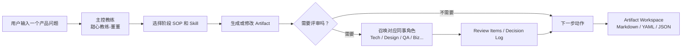

# Product Crew OS

[](releases/v0.1.1.md)
[](LICENSE)
[](README.md)
[](product-crew-os-skill/tests)
[](product-crew-os-skill/SKILL.md)
[](#多平台使用)
[](#多平台使用)

一间给产品经理用的 AI 产品办公室。

Product Crew OS 让你主要和一个主控产品教练对话。主控教练会判断你当前处在哪个产品阶段，调用合适的 skill，在关键节点召唤可配置的同事角色参与评审，并把讨论结果沉淀成可继续编辑的产品产物。

它的目标不是制造一个热闹的多 Agent 群聊，而是给产品经理提供一套温暖、主动、可持续的全流程产品工作系统：从想法判断、需求验证、方案设计、PRD、评审、任务拆解，到验收、上线和复盘，都有人带你往前走。

你也可以自由定制这支 AI 产品团队：主控教练叫什么、说话风格如何；技术、业务、设计、测试、客户成功等角色是什么性格、严不严格、像不像你真实公司的同事，都可以按你的工作习惯调整。

```text
Workflow + Skill + Review + Artifact Workspace
```

## Start Here

你不需要先记命令。直接把真实工作丢进来：

```text
我有一个产品想法，帮我判断值不值得做。
```

```text
我写完 PRD 了，帮我做一次内审。
```

```text
客户提了一个需求，帮我判断这是真需求还是伪需求。
```

Product Crew OS 会回答三件事：

1. 你现在处在哪个产品阶段。
2. 下一步应该产出什么 artifact。
3. 需要找谁对齐，是否要召唤业务、技术、设计、数据、测试、法务、运营、CS 或客户代表评审。

## 适合谁

- 刚入行或正在成长的产品经理。
- 想拥有专属 AI 产品团队的产品经理。
- 希望把产品流程、评审标准和项目记忆沉淀成可复用工作系统的人。

## 你会得到什么

| 场景 | Product Crew OS 会帮你推进到 |
| --- | --- |
| 只有一个想法 | 商业判断、问题定义、验证计划 |
| 需求很乱 | 真伪需求判断、证据盘点、调研问题 |
| 要开始做方案 | MVP 范围、一页方案、流程图、低保真原型 brief |
| 要写 PRD | PRD 草稿、产品自审、正式评审记录 |
| 要交付研发 | Epic / Story / Task、验收标准、测试场景 |
| 要上线 | 上线清单、灰度试点、运营培训、复盘记录 |

## 可召唤的产品团队

Product Crew OS 的团队成员是可配置的子 Agent，但它们不会常驻在前台抢话。

默认体验是：你主要和主控教练对话。主控教练会在需要真实评审的时候，按当前阶段短暂召唤对应团队成员，例如：

- 商业论证时，召唤业务负责人、数据负责人或客户代表，判断值不值得做。
- 需求验证时，召唤用户调研、CS 或客户代表，判断是真需求还是伪需求。
- 方案设计时，召唤技术负责人、产品设计和测试负责人，提前暴露实现风险和体验断点。
- PRD 评审时，召唤业务、技术、设计、测试、数据等角色，形成 review items、decision log 和下一步动作。

每个团队成员都可以绑定自己的角色边界、说话风格和性格参数。你可以把他们调成“谨慎的架构师”“很直接的业务负责人”“特别难缠的客户代表”，也可以逐步用真实项目里的邮件、会议纪要和同事反馈，在用户授权后反哺角色风格。

主控教练负责收束分歧：子 Agent 给意见，主控教练做汇总、提醒冲突、推动决策，并把结果写回 Artifact Workspace。

## 它怎么工作



默认主控教练是 **甜心教练-董董**：魅力型领袖，思虑周全，亲和力拉满。这个名字和性格只是预设，用户可以改。

默认团队角色包括：

| 角色 | 默认昵称 | 主要负责 |
| --- | --- | --- |
| 业务负责人 | 包总 | 商业目标、优先级、资源冲突 |
| 技术负责人 | 张工 | 可行性、依赖、范围、技术风险 |
| 产品设计 | 文设计 | 信息架构、流程、交互状态 |
| 用户调研 | 研希 | 证据、访谈、用户动机 |
| 客户成功 / CS | 阿笨 | 采纳、培训、客户反馈 |
| 客户代表 | 黑老板 | 外部诉求、验收压力、购买决策 |
| 数据负责人 | 陈数 | 指标、口径、埋点、数据可信度 |
| 测试负责人 | 李测 | 验收标准、边界条件、回归风险 |
| 法务合规 | 周律 | 授权、合规、外部触达边界 |
| 运营培训 | 洪运 | 上线 SOP、培训、试点执行 |

这些角色不是固定剧本。用户可以用自己的团队风格覆盖默认配置，比如“技术负责人更谨慎”“业务负责人更直接”“客户代表更难缠”。真实同事邮件、会议纪要或回复语气只有在用户授权后，才能进入项目或用户级记忆。

## 三种使用方式

| 模式 | 适合场景 | 示例 |
| --- | --- | --- |
| 单点能力调用 | 只想快速完成一个任务 | 帮我判断这个需求是真需求还是伪需求 |
| 完整工作流推进 | 从想法走到 PRD 或上线 | 帮我从一个想法走到可评审 PRD |
| 中途插入 | 项目已经进行中，某个点卡住 | 我 PRD 写一半了，帮我看缺什么 |

## 能力地图

| 分组 | 可以帮你做什么 |
| --- | --- |
| 项目接入 | 项目卡、当前阶段、下一步 |
| 商业与战略判断 | 商业论证、价值评估、优先级 |
| 需求发现与验证 | 真伪需求判断、证据盘点、调研计划 |
| 用户理解 | 用户分层、JTBD、旅程地图 |
| 方案设计 | 方案对比、MVP 范围、一页方案 |
| 流程与原型 | 流程图、低保真原型、HTML Demo、Pencil / Figma 承接 |
| 数据与指标 | 北极星指标、指标树、埋点计划 |
| PRD 与评审 | PRD 草稿、产品自审、正式评审 |
| 交付拆解 | Epic / Story / Task、验收标准、测试场景 |
| 上线与运营 | 上线清单、培训 SOP、灰度试点 |
| 复盘与迭代 | 上线监控、复盘、下一版 backlog |

完整 SOP 见 [workflow-sop-library.md](product-crew-os-skill/references/workflow-sop-library.md)。

## 快速安装

### Codex

把 `product-crew-os-skill/` 复制到 Codex skills 目录：

```text
~/.codex/skills/product-crew-os/
```

然后在 Codex 中调用：

```text
$product-crew-os
```

如果你的运行环境支持隐式 skill 调用，产品工作流相关请求也可以自动触发。

## 多平台使用

Product Crew OS 当前以 Codex skill 包为主，但它的核心是 Markdown / YAML / JSON 规则包，可以迁移到其他 AI coding 或 agent 工作环境。

| 平台 | 使用方式 | 状态 |
| --- | --- | --- |
| Codex | 复制 `product-crew-os-skill/` 到 `~/.codex/skills/product-crew-os/` | 原生支持 |
| Claude Code / Claude | 将 `SKILL.md`、`config/`、`references/`、`templates/` 放入项目规则或自定义技能目录 | 可迁移 |
| Cursor | 将 `SKILL.md` 的主规则整理进 `.cursor/rules`，并保留 references/templates 作为项目上下文 | 可迁移 |
| Windsurf | 将规则包作为 workspace rules / project context 使用 | 可迁移 |
| OpenCode / Kiro / Gemini CLI | 复制 skill 文件夹到对应工具的 skills 或 rules 目录 | 可迁移 |

多平台迁移时请保留三类边界：

- 主控教练是唯一可见入口，不要改成多 Agent 群聊。
- 子 Agent 只在阶段门或评审需要时短暂进场。
- 用户偏好和具体项目记忆不要写入公共规则包。

## 本地质检

clone 后在仓库根目录执行：

```text
ruby product-crew-os-skill/tests/validate-package.rb
ruby product-crew-os-skill/tests/run-regression.rb --mock-delegate --check-only
```

预期输出：

```text
validate-package: PASS
run-regression: PASS
```

`validate-package.rb` 会检查配置、模板和回归场景是否齐全；`run-regression.rb` 会用 mock delegate 验证真实子 Agent 调用 ledger、模拟视角降级、memory_snapshot 和 memory delta 的最小闭环。

## 示例

- [新用户首次启动 Demo](examples/first-run-demo.md)
- [PRD 内审 Demo](examples/prd-review-demo.md)

## 目录导览

```text
product-crew-os/
  README.md
  docs/
    product-rules.md
    portability-manifest.md
  product-crew-os-skill/
    SKILL.md
    config/
    references/
    templates/
    tests/
  examples/
  releases/
```

重点文件：

- [Product rules](docs/product-rules.md)：产品机制和边界规则。
- [Portability manifest](docs/portability-manifest.md)：可迁移清单。
- [Skill entry](product-crew-os-skill/SKILL.md)：Codex skill 入口。
- [Workflow SOP library](product-crew-os-skill/references/workflow-sop-library.md)：完整 PM 流程 SOP。
- [Sub-agent invocation contract](product-crew-os-skill/references/subagent-invocation-contract.md)：真实调用与模拟视角边界。
- [Sub-agent memory runtime](product-crew-os-skill/references/subagent-memory-runtime-contract.md)：角色记忆注入和反哺机制。

## 记忆边界

Product Crew OS 使用三类记忆容器：

| 容器 | 内容 | 是否可进入开源包 |
| --- | --- | --- |
| Product Rule Memory | 通用产品机制、workflow、stage gate、artifact 规则 | 可以 |
| User Preference Memory | 用户称呼、主控名称、个人语气偏好 | 不可以 |
| Project Workspace Memory | 具体项目 PRD、访谈、评审、决策 | 不可以 |

发布到 GitHub 时，只应包含 Product Rule Memory。

子 Agent 聊天窗口本身不是长期记忆容器。长期记忆由 Project Workspace 管理，并在每次召唤角色时由主控教练压缩注入 context packet。

## 当前版本

当前 release：`v0.1.1`

`v0.1.1` 重点优化 GitHub 首屏可读性和新用户进入路径。核心规则能力沿用 `v0.1.0-alpha`，包括：

- Deep Artifact Pack。
- 低保真原型，并支持 image 概念图 -> HTML Demo -> Pencil / Figma 的逐级增强路径。
- 技术任务拆解。
- PM skill 适配。
- 测试场景。
- 17 个回归场景。

## 许可证

MIT License。见 [LICENSE](LICENSE)。
