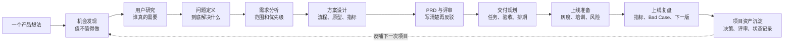
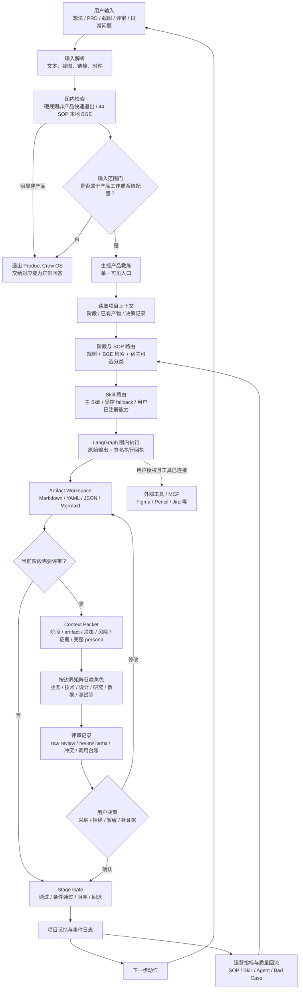
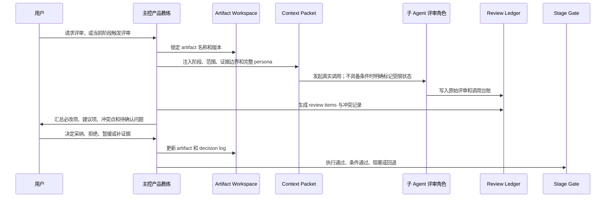
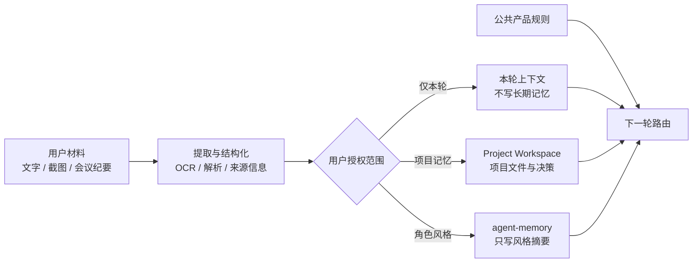

# Product Crew OS

[](releases/v0.2.3.md)
[](LICENSE)
[](product-crew-os-skill/references/workflow-sop-library.md)
[](product-crew-os-skill/references/bundled-skill-index.md)

一间给产品经理用的 AI 产品办公室。

Product Crew OS 不把产品工作变成一群 Agent 聊天。用户主要只和一个主控产品教练对话；主控负责判断你在做什么、处在哪个阶段、该命中哪张 SOP、该调用什么能力、是否需要评审，并把过程沉淀为能继续编辑和复盘的项目文件。

它解决的不是“AI 能不能帮我写文档”，而是产品经理推进 0-1 时最常见的几件事：不知道下一步做什么、需求没有被充分反驳、评审和决策找不回来、项目经验无法复用。

```text
Workflow + Skill + Review + Artifact Workspace
```

## 开始使用

直接把真实工作交给它：

```text
我有一个产品想法，先帮我判断值不值得做。
```

```text
我写完 PRD 了，帮我做一次内审。
```

```text
客户提了一个需求，帮我判断是真需求还是伪需求。
```

它会先告诉你三件事：

1. 你现在处在哪个产品阶段。
2. 这一步应该产出什么文件。
3. 是否需要业务、技术、设计、数据、测试、法务或一线角色一起评审。

普通翻译、闲聊、生活问答或通用代码问题不会被强行塞进产品 SOP。只有产品工作或 Product Crew OS 自身配置，才会进入这套流程。

## 你会得到什么

| 场景 | Product Crew OS 会帮你推进到 |
| --- | --- |
| 只有一个想法 | 机会判断、问题定义、关键假设、验证计划 |
| 需求很乱 | 证据清单、真伪需求判断、用户调研问题 |
| 要开始做方案 | MVP 范围、方案对比、核心流程、原型 brief |
| 要写 PRD | PRD 草稿、产品自审、评审记录 |
| 要交付研发 | 任务拆解、验收标准、测试场景 |
| 要上线和复盘 | 上线清单、监控指标、复盘和下一版计划 |
| 要沉淀项目资产 | 项目首页、决策、风险、评审项和 Markdown 项目包 |

## 前台很简单，后台有依据

前台只需要看到：现在在做什么、下一步是什么、有什么风险、谁需要拍板。

后台会保留：路由依据、Skill 执行回执、评审原文、Stage Gate、项目记忆和 Bad Case。这样系统不是“看起来做了”，而是每一步都能回头检查。

## 从想法到复盘

这张图是产品经理最容易理解的主流程。它描述的是完整产品工作通常会怎么推进，不代表每个阶段都已经完成同等深度的真实业务验证。



## 系统如何把控流程

运行时由 Python + LangGraph 控制。它先检索和判断，再决定是否进入产品流程；不是主控教练读完一句话就直接“拍脑袋选 SOP”。



`template_degraded` 只是明确的降级状态：可以保留为草稿或待办，但不算 Skill 真执行，也不能让 Stage Gate 假通过。

一句“我想做一个产品”的输入也不会被硬扩写成市场事实。系统在 `project_intake` 只确认用户原话、创建项目卡和路由记录；目标用户、痛点、需求评分、方案和 MVP 都只是待验证项。缺少负责人、目标用户或粗略目标时，项目接入会停在澄清，不会假装已经进入方案设计。

## 子 Agent 评审不是“角色扮演”

正式评审必须围绕一个明确的 artifact。主控先锁定版本，再给每个角色完整的 Context Packet，最后把原始意见、冲突和用户决定留在项目里。



子 Agent 只能给意见，不能替用户做最终决定。要让评审成为 Gate 依据，必须同时满足：完整 Persona Context Packet、允许的运行时角色 ID、原文评审记录和回调校验。缺失时必须标为 `simulated` 或 `runtime_blocked`，不能冒充真实评审。

默认需要时可召唤的角色包括：业务、技术、设计、用户研究、数据、测试、法务、运营、客户成功和客户代表。每个角色的边界、语气和关注点都可配置；真实同事材料只有在用户明确授权后，才能写入相应项目记忆或角色风格摘要。

## 项目文件和记忆隔离

项目不是一段聊天记录，而是一套能回溯的资产。每个项目会按实际推进情况写入：

```text
project-state.json      当前阶段、Gate、版本和下一步
artifact-index.yaml     产物索引
decision-log.md         用户采纳、拒绝和延期的原因
review-items.yaml       评审项和状态
raw-review-records/     角色原始评审
risk-log.md             风险、阻塞和依赖
agent-memory/           当前项目内的角色记忆摘要
state-machine/          事件和状态流转记录
badcases/               错误案例、原因和修复记录
```

Project Workspace 是项目事实源。Obsidian、Word、PDF、Notion、飞书等只是导出或镜像；Obsidian 不是必装依赖。



公共产品规则、用户偏好和项目材料必须隔离。项目材料不能写进开源规则包；没有授权的邮件、会议纪要或语气素材不能进入长期记忆。

## 它怎么知道自己有没有做对

Product Crew OS 不把“写出一份文档”当作成功。每个项目可生成中文运营指标，先看这三件事：

| 看什么 | 什么情况下才算成功 |
| --- | --- |
| SOP 命中率 | 用户明确确认当前 SOP 正确；未确认的不算正确。 |
| Skill 真执行率 | Skill 在 LangGraph 内真实运行，并持有有效的签名执行回执。 |
| 子 Agent 回调率 | 真实角色回调、身份匹配、原文评审和校验都通过。 |

当用户纠正 SOP、Skill 跑不起来，或子 Agent 回调无效时，系统会写入 Bad Case。相同问题累计到阈值后，只生成“待人工确认”的调参建议，不会自己偷偷改路由规则。

## 已包含的能力

- 44 个 SOP 卡片、路由和最小运行时链路。
- 49 个随包 PM Skill，以及用户自有能力的受控接入入口。
- Python + LangGraph Runtime：控制检索、路由、Skill 执行、回执和 Gate。
- SQLite Runtime：记录项目、产物版本、决策、评审、调用台账和指标。
- Artifact Workspace：输出 Markdown、YAML、JSON 等可追溯文件。
- 本地文本、图片和截图资料接入；PaddleOCR 为主路径，Tesseract 为 fallback。
- 本地质量测试：包校验、路由、运行时、SOP、评审循环、Bad Case 和资料接入。

## 真实边界

- 44 个 SOP 都有卡片、路由和最小测试链路；不等于每个 SOP 都完成了深度真实业务验证。
- 49 个 Skill 都可被执行器发现；真实执行还取决于本机 Ollama、命令脚本或已连接 MCP。依赖缺失时会返回 `deployment_required`，不会伪装成功。
- Skill 被路由到，不等于已执行。只有 LangGraph 实际执行并签发回执，或授权外部工具返回可验证证据，才能作为 Gate 依据。
- 子 Agent 是否能真实调用取决于宿主是否部署 delegation。没有真实调用条件时，系统必须如实标记，不能假装已经召唤。
- OCR、Embedding、向量库和外部 MCP 都依赖本地或已连接环境。依赖缺失时必须显示受限状态。
- 低置信 OCR、未授权或未索引来源可以作为参考，但不能作为最终 Gate 证据。

## 安装与验证

### Codex

复制完整 `product-crew-os-skill/` 到：

```text
~/.codex/skills/product-crew-os/
```

不要只复制 `SKILL.md`；`config/`、`references/`、`templates/`、`tests/` 和 `third_party/skills/` 都是能力的一部分。

### 本地验证

在仓库根目录运行：

```text
python3 -m venv .venv
.venv/bin/pip install -r product-crew-os-skill/runtime/requirements-langgraph.txt
.venv/bin/python product-crew-os-skill/tests/validate-package.py
.venv/bin/python product-crew-os-skill/tests/run-langgraph-runtime-e2e.py
.venv/bin/python product-crew-os-skill/tests/run-python-runtime-adapters-e2e.py
.venv/bin/python product-crew-os-skill/tests/run-operational-metrics-e2e.py
.venv/bin/python product-crew-os-skill/tests/run-project-intake-guard-e2e.py
.venv/bin/python product-crew-os-skill/tests/run-release-gate.py
```

测试验证本地规则、路由、运行时写入和门禁，不代表线上用户效果。

## 关键文档

- [Skill 入口](product-crew-os-skill/SKILL.md)
- [44 SOP 库](product-crew-os-skill/references/workflow-sop-library.md)
- [Skill 索引](product-crew-os-skill/references/bundled-skill-index.md)
- [状态机与实现边界](product-crew-os-skill/references/workflow-implementation-coverage-v0.md)
- [子 Agent 调用契约](product-crew-os-skill/references/subagent-invocation-contract.md)
- [Runtime 使用说明](product-crew-os-skill/runtime/README.md)
- [LangGraph 控制平面](product-crew-os-skill/references/langgraph-runtime-architecture.md)
- [v0.2.3 发布说明](releases/v0.2.3.md)

## 许可证

Product Crew OS 自有规则、模板、配置和测试按 [MIT License](LICENSE) 授权。

`product-crew-os-skill/third_party/skills/` 下的第三方 Skill 保留各自许可证；请查看 [THIRD_PARTY_NOTICES.md](product-crew-os-skill/THIRD_PARTY_NOTICES.md)。
