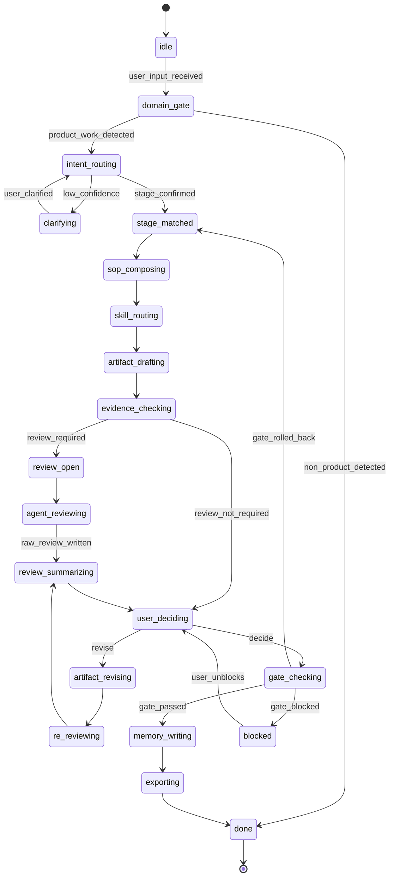

# Product Crew OS 状态机看板

> 可直接放入 Obsidian Vault。Obsidian 会渲染下面的 Mermaid 状态机。

## 用户前台状态卡

```text
现在在判断：这个想法是否值得继续验证
本轮交付：方向判断 / 需求真伪检查 / 验证计划
本轮不承诺：不进入 PRD / 不批准 MVP / 不保证客户采用
关键风险：竞品替代、材料隐私、行动项后续无人确认
谁来把关：业务把关人 / 研究把关人
你需要拍板：先验证 / 先扫竞品 / 缩小范围 / 暂停
你可以纠偏：改阶段 / 改产物 / 加角色 / 改执行深度
```

## 后台状态机



## Golden Case

- 覆盖主流程：`flow_01_opportunity_discovery`
- 覆盖状态：`covered_by_this_case`
- 未覆盖主流程：其余 7 个主流程只建立索引，尚未有完整 Golden Case。
- 回归 fixture：`product-crew-os-skill/tests/golden-cases/flow-01-opportunity-discovery-pass.yaml`
