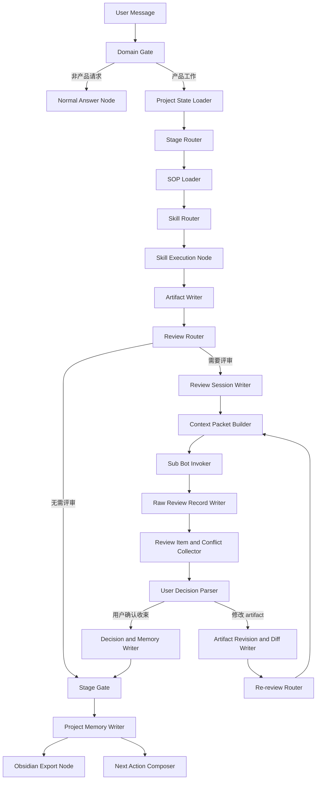

# Coze Runtime Blueprint / Coze 运行形态蓝图

本文件定义 Product Crew OS 如果迁移到 Coze 这类 Bot + Workflow + Database 平台时，应该如何拆成可运行产品。

## 1. 产品形态

Coze 版本不是把 README 复制进去，而是拆成：

```text
主控 Bot
-> Workflow 节点
-> 子 Bot / 角色 Bot
-> 数据库表
-> Artifact 文件服务
-> Obsidian / Markdown 导出插件
```

主控 Bot 仍然是用户唯一主要对话入口。子 Bot 不常驻前台，只在 Stage Gate、Review Loop 或 SOP 要求时被 workflow 节点调用。

启动时必须先按 `host-runtime-compliance.md` 做 capability handshake。没有真实 embedding 节点、向量索引、数据库写入或子 Bot 调用节点时，Coze 只能输出 `runtime_not_connected` / `runtime_degraded`，不能说已经按 Product Crew OS 标准 SOP 运行。

## 2. Bot 设计

| Bot | 职责 | 是否直接面向用户 |
| --- | --- | --- |
| `CoachBot` | 主控教练，负责识别 Stage、调 SOP、收束决策、写入记忆 | 是 |
| `BizBot` | 商业、优先级、资源和价值判断 | 否 |
| `TechBot` | 技术可行性、依赖、范围和风险 | 否 |
| `DesignBot` | 流程、信息架构、低保真和体验断点 | 否 |
| `ResearchBot` | 用户证据、访谈、JTBD、洞察质量 | 否 |
| `DataBot` | 指标、口径、埋点和数据可信度 | 否 |
| `QABot` | 验收标准、测试场景、边界用例 | 否 |
| `CSBot` | 客户采纳、培训、售后反馈 | 否 |
| `CustomerBot` | 客户代表视角、验收压力、购买决策 | 否 |
| `LegalBot` | 合规、授权、外部材料边界 | 否 |
| `OpsBot` | 上线、运营、培训、试点执行 | 否 |

每个子 Bot 必须接收统一的 Context Packet，不能自己凭空读取项目历史。

## 3. Workflow 节点



Coze 如果没有把这些节点接成实际 Workflow，只把本文件或 README 放进 Bot Prompt，则不算已部署 Product Crew OS。主控 Bot 必须返回 `runtime_not_connected` 或 `runtime_degraded`，不能声称已经调用 SOP、skill、embedding 或子 Bot。

## 4. 节点输入输出

| 节点 | 输入 | 输出 |
| --- | --- | --- |
| Domain Gate | user_message | `product_work | product_config | general_task | unknown` |
| Project State Loader | project_id | project_state、latest_artifacts、open_reviews |
| Stage Router | user_message、project_state | stage_id、macro_stage、confidence |
| Route Trace Writer | route decision | `stage-route-decision` 事件、`route_decision_id`、candidate routes |
| Embedding Recall Node | user_message、44 SOP prompt-eval set | top-K SOP candidates、real_embedding_performed、source_refs |
| SOP Loader | stage_id | sop_id、required_input、required_artifact、stakeholders、gate |
| Skill Router | stage_id、sop_id、user_overlay | primary_skill、fallback_skill、selected_skill |
| Skill Execution Node | selected_skill、user_message、context | draft_output、source_refs |
| Artifact Writer | draft_output、stage_id、sop_id | artifact_id、version、path |
| Review Router | stage_id、artifact_id、gate | required_roles |
| Review Session Writer | artifact_id、version、required_roles | review_session_id、locked_artifact_version |
| Context Packet Builder | role_key、artifact、memory | context_packet_id、packet |
| Sub Bot Invoker | role_key、packet | invocation_id、real_invocation_performed、raw_review |
| Raw Review Record Writer | raw_review、invocation_id | raw_review_record_id、record_path |
| Review Item and Conflict Collector | raw_review_records | review_items、conflict_matrix、open_questions |
| User Decision Parser | 用户指令、review_items、conflicts | accepted_items、rejected_items、deferred_items、needs_confirmation |
| Artifact Revision and Diff Writer | accepted_items、artifact | new_artifact_version、artifact_diff |
| Re-review Router | artifact_diff、affected_roles | re_review_roles |
| Decision and Memory Writer | review_items、user_decisions、memory_candidates | decisions、memory_deltas |
| Runtime Preflight | route trace、selected skill、artifact、review evidence | preflight_status、blocking_reason |
| Stage Gate | artifact、review_items、gate、runtime_preflight | gate_status、conditions、next_stage |
| Project Memory Writer | all outputs | database rows、event-log、project files |
| Obsidian Export Node | project_id | markdown vault path |
| Next Action Composer | gate_status、next_stage | visible coach response |

## 5. 数据库表

Coze 数据库或外部数据库至少需要这些表。字段可直接参考 `runtime/db/schema.sql`。

| 表 | 用途 |
| --- | --- |
| `projects` | 项目主页和当前状态 |
| `stages` | 阶段推进记录 |
| `sop_runs` | 每次 SOP 执行 |
| `skill_runs` | skill 选择和执行记录 |
| `artifacts` | 当前 artifact 索引 |
| `artifact_versions` | artifact 版本 |
| `review_sessions` | 评审会状态、artifact 锁定版本、参与角色 |
| `raw_review_records` | 每个子 Bot 的原始评审输出 |
| `decisions` | 决策日志 |
| `review_items` | 评审项 |
| `conflict_matrix` | 角色冲突点、用户决策、处理状态 |
| `open_questions` | 缺证据和待确认问题 |
| `agent_memories` | 项目内角色记忆 |
| `memory_deltas` | 记忆增量写回 |
| `context_packets` | 子 Bot 调用上下文 |
| `agent_invocations` | 子 Bot 调用账本 |
| `events` | 指标事件 |
| `route_traces` 或 `events(stage_route_decision)` | 每轮 route decision、candidate routes、retrieval mode、confidence |
| `fts_documents` | 全文检索 |
| `routing_feedback` | Stage / SOP 纠偏 |

## 6. Coze 插件 / API 动作

建议把本地 runtime 封装成插件 API：

| Action | 对应本地命令 |
| --- | --- |
| `runtime_init_project` | `init-project` |
| `runtime_route_intent` | `route-intent` |
| `runtime_record_turn` | `record-turn` |
| `runtime_save_artifact` | `save-artifact` |
| `runtime_open_review_session` | `record-turn` 中的 Review Session Writer |
| `runtime_build_context_packet` | `build-context-packet` |
| `runtime_record_invocation` | `record-invocation` |
| `runtime_write_raw_review_record` | `record-turn` 中的 Raw Review Record Writer |
| `runtime_write_review_item` | `write-review-item` |
| `runtime_write_agent_memory` | `write-agent-memory` |
| `runtime_export_obsidian` | `export-obsidian` |

## 7. 调用子 Bot 的强约束

Coze 版本如果支持真实子 Bot，必须写入：

```yaml
agent_invocation:
  role_key: Tech
  runtime_agent_id: coze_bot_xxx
  context_packet_id: ctx_xxx
  real_invocation_performed: true
  simulation_label_used: false
```

如果子 Bot 调用失败：

```yaml
agent_invocation:
  role_key: Tech
  runtime_agent_id: ""
  real_invocation_performed: false
  simulation_label_used: true
```

可降级为模拟角色视角，但必须在用户可见回复里说明。

同线程角色扮演、Prompt 内部切换人格、或主控自己写“张工说”，都不是 `real_invocation_performed=true`。这些内容必须写成 `advice_only / invalid_for_gate`，不能满足 Required Role。

## 8. 最小可上线版本

Coze M1 最小闭环：

1. 主控 Bot 接收用户输入。
2. Workflow 调用 `runtime_route_intent` 或等价节点，并保存 route trace。
3. Workflow 命中 Stage、SOP 和 selected skill。
4. Skill Execution Node 执行真实 skill；如果只能走模板，标记 `template_degraded`。
5. 写 artifact。
6. Runtime Preflight 校验 route trace、stage、skill 和 review evidence；失败时 gate 降级为 `blocked_runtime_preflight`。
7. 对需要评审的 stage 创建 Review Session，并按批次调用必要子 Bot。
8. 写 raw_review_records、review_items、conflict_matrix、open_questions。
9. 让用户决定采纳、拒绝、暂缓或补证据。
10. 修改 artifact 后生成 artifact_diff，并只让相关角色复评。
11. 写 decisions、agent_memories。
12. 给用户返回下一步。
13. 支持导出 Obsidian-compatible 项目包。

## 9. 不建议做的事

- 不要让所有子 Bot 常驻聊天。
- 不要让子 Bot 自己决定 stage gate。
- 不要把 raw meeting transcript 默认写入长期记忆。
- 不要让 Obsidian 成为事实源。
- 不要在未调用真实子 Bot 时声称已经调用。
