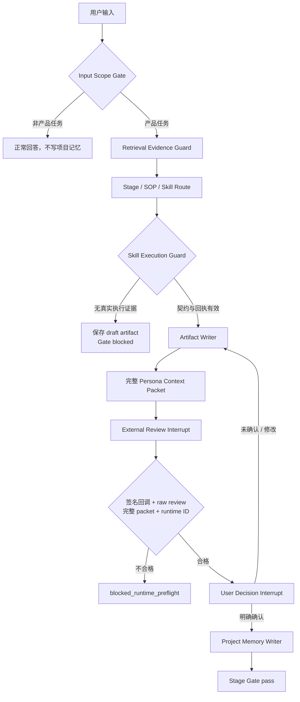

# LangGraph Runtime Architecture / LangGraph 运行时架构

## 目的

LangGraph 是 Product Crew OS 的**控制平面**：把 SOP 命中、能力执行、评审、用户决策和阶段门串成可暂停、可恢复、可审计的图。它不替代 44 张 SOP，不替代专业 Skill，也不替用户作决定。

输入范围门先硬排除明显非产品任务；随后它可以读取同一份 44 SOP `prompt-eval` 本地候选库，也可以接收有 provider、model、来源引用的真实 embedding 候选。没有可验证 embedding 时，路由才使用明确标注为 `local_prompt_eval_lexical` 的本地词法候选和阶段别名。词法候选不能伪装成 real embedding；开启真实 embedding 要求而没有有效证据时，图在路由前停止。

## 三条不可越权的边界

1. **Skill 有专业自主权，但没有流程控制权**：它可以使用自己的方法和输出格式；不能改 Stage、决定 Gate、写项目记忆或召唤角色。
2. **子 Agent 可以提出评审意见，但没有最终决策权**：真实调用必须验证完整 persona packet、签名 delegate proof、runtime ID 和 raw review；没有证据就是 `invalid_for_gate`。
3. **用户拥有最终确认权**：图只能在 `user_confirmed=true` 后通过 Gate。中断、checkpoint、生成文档或模板降级都不是通过。

## 数据边界

| 数据 | 存放位置 | 用途 |
| --- | --- | --- |
| 图执行状态 | LangGraph SQLite checkpoint | 断点恢复，按 `thread_id` 继续 |
| 项目事实 | Project SQLite + Workspace | artifact、决策、评审、记忆、Obsidian 导出 |
| 检索证据 | RAG adapter / source ledger | 来源、授权、embedding provider、召回记录 |
| 外部能力 | 受控 Skill / MCP adapter | 专业执行；必须返回契约与回执 |

Python adapter 覆盖 Coze Bridge、OCR/RAG、CLI 与 Skill 执行。每个 adapter 都必须通过同等级的 Gate、raw review 可见性、`runtime_nickname` 审计隔离和持久化回归，才能进入发布门禁。
