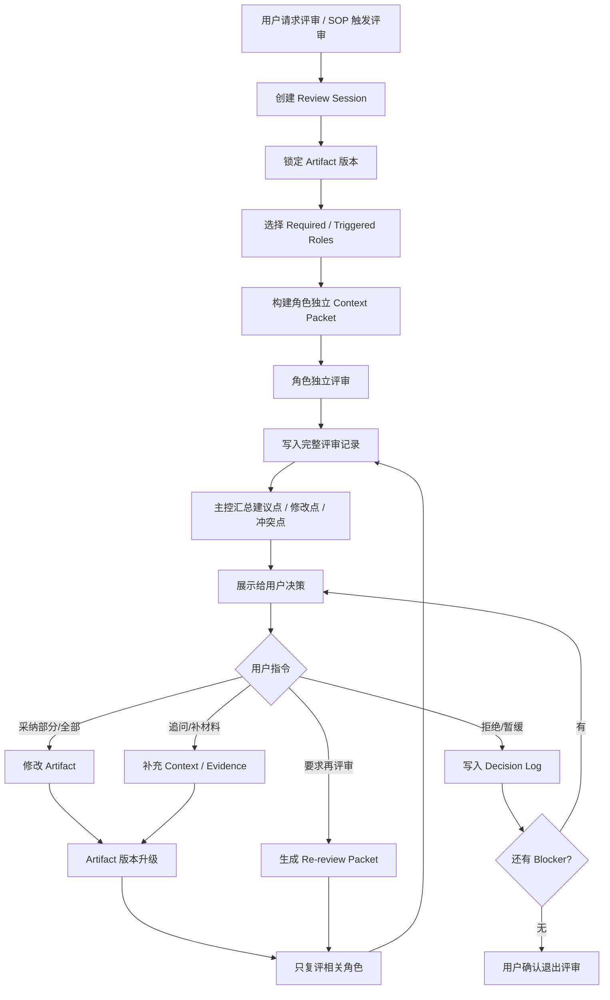

# Structured Review Loop / 结构化评审闭环

本文件定义 Product Crew OS 如何把“子 Agent 评审”从口头模拟升级为可见、可追溯、用户可控的评审状态机。

核心原则：

```text
不是让 Agent 无限群聊，而是围绕 artifact 做独立评审、冲突收束、用户决策、版本修订和复评。
```

主控教练可以组织评审、提炼冲突、建议下一步，但不能替用户采纳或拒绝评审意见，也不能把未解决的 block 擅自改成 pass。

## 1. 适用场景

当满足以下任一条件时，进入 Structured Review Loop：

- 用户明确说“评审一下”“拉业务/技术/设计看看”“正式需求评审”。
- SOP 或 Stage Gate 要求某个角色评审后才能过关。
- 当前 artifact 影响多个角色边界，例如 PRD、技术方案、上线方案、数据口径、客户承诺。
- 上一轮评审有 unresolved blocker、冲突点或用户要求复评。

普通轻量问题不进入完整评审会。主控教练可以只给建议或调用单个角色视角。

## 2. 状态机



## 3. Review Session

每次评审必须绑定明确对象，而不是评审一段模糊聊天历史。

```yaml
review_session:
  session_id: RS-001
  stage_id: formal_requirements_review
  artifact_id: prd-v0
  artifact_version: v0.3
  status: review_open
  required_roles:
    - Biz
    - Tech
    - Design
    - Data
  triggered_roles:
    - QA
    - Customer
  review_mode: structured
  decision_owner: user
```

`artifact_version` 是评审锁定对象。只要 artifact 修改后版本升级，旧评审记录仍保留，新一轮复评必须基于新版本。

## 4. 独立评审

第一轮评审默认独立进行：

- 每个角色只读取自己的 context packet。
- 每个角色不先看其他角色结论，避免互相污染。
- 每个角色必须绑定 artifact 具体位置、证据边界和自己的 role scope。
- 如果运行环境支持真实子 Agent，应真实调用并写入 invocation ledger；否则必须标注为模拟视角。

每个角色的输出必须结构化：

```yaml
review_item:
  id: RI-001
  session_id: RS-001
  role_key: Tech
  conclusion: block
  artifact_ref: "prd-v0.md#退款流程"
  issue: "退款异常状态没有定义"
  impact: "研发无法确认状态机和测试边界"
  suggestion: "补充退款中、退款成功、退款失败、人工介入四个状态"
  priority: must_fix
  evidence_level: from_artifact
  status: open
```

## 5. 用户可见评审全记录

聊天框只展示主控摘要，但 Artifact Workspace 必须沉淀完整记录：

| 文件 | 作用 |
| --- | --- |
| `review-session.md` | 本轮评审总览、参与角色、artifact 版本、状态 |
| `raw-review-records/<role_key>.md` | 每个角色的原始评审意见 |
| `review-items.yaml` | 结构化问题、建议、优先级、状态 |
| `conflict-matrix.md` | 冲突点、冲突双方、主控建议、用户决策 |
| `decision-log.md` | 用户采纳、拒绝、暂缓和理由 |
| `open-questions.md` | 缺证据或未确认问题 |
| `artifact-diff.md` | 本轮根据评审修改了什么 |

用户必须能够看到评审依据，而不是只能看到主控二手总结。这里的 `raw review` 指每个角色独立给出的原始评审记录。

## 6. 主控收束规则

主控教练汇总时只做归纳和推进，不替用户决策。输出按四类组织：

| 类别 | 含义 | 默认动作 |
| --- | --- | --- |
| 必须修改 | 不改不能过 Stage Gate | 进入 must-fix |
| 建议修改 | 改了更好，但不阻塞 | 进入 should-fix |
| 冲突点 | 角色之间意见不一致 | 写入 conflict matrix，等待用户决策 |
| 待确认 | 缺证据，不能凭主控猜 | 写入 open questions |

禁止行为：

- 把 `block` 擅自改成 `pass`。
- 只保留主控摘要，丢掉原始角色意见。
- 用“大家都同意”概括实际有冲突的评审。
- 没有 artifact_ref 的评审项直接进入修改。

## 7. 用户决策与意图识别

用户看到评审记录后，可以给具体或模糊指令。

具体指令示例：

```text
采纳 Tech 的第 1、2 条，Design 的第 3 条先不做。
```

模糊指令示例：

```text
你看着改，先保证能过评审。
```

主控教练必须先识别用户意图：

```yaml
user_review_intent:
  action: revise_artifact
  scope: must_fix_only
  accepted_items:
    - RI-001
    - RI-002
  rejected_items: []
  deferred_items:
    - RI-006
  needs_confirmation: true
```

如果用户指令模糊且会影响范围、承诺、上线、合规或客户关系，主控教练必须先确认理解：

```text
我理解你是让我先处理所有 must-fix，不动 should-fix，对吗？
```

## 8. 修改与复评

Artifact 修改后必须生成新版本，并建立 review item 到修改内容的映射。

复评不默认重跑全员，只叫受影响角色：

| 修改类型 | 默认复评角色 |
| --- | --- |
| 技术状态、接口、权限、性能 | Tech / QA |
| 指标、埋点、口径、算法 | Data / Tech |
| 页面、流程、文案、状态 | Design / CS |
| 客户承诺、验收、购买压力 | Biz / Customer / Legal |
| 上线风险、回滚、缺陷 | QA / Tech / Ops |

复评只回答三个问题：

1. 上轮问题是否解决。
2. 是否引入新问题。
3. 是否从 block 变为 conditional pass 或 pass。

## 9. 退出条件

Review Session 只能在用户确认后关闭。

```yaml
review_exit:
  all_must_fix_resolved: true
  unresolved_items:
    - should_fix
    - later
  gate_status: conditional_pass
  user_confirmed_exit: true
```

如果还有 `must_fix` 或 `block` 未解决，主控教练不能说“评审通过”，只能说“仍有阻塞，建议继续修订或回退到对应阶段”。

## 10. 质量保障

一次合格的结构化评审必须满足：

- 有 `review_session_id`。
- 有明确 artifact 和版本。
- 每个角色有 context packet。
- 每条建议有 `role_key`、`artifact_ref`、priority 和 status。
- 评审全记录可见。
- 冲突点进入 conflict matrix。
- 用户采纳、拒绝、暂缓进入 decision log。
- Artifact 修改后产生新版本。
- 复评只召唤相关角色。
- 退出评审需要用户确认。

这套机制的目标不是把聊天变热闹，而是让用户相信：每一条评审意见从哪里来、改了什么、为什么过关，都能被追溯。
