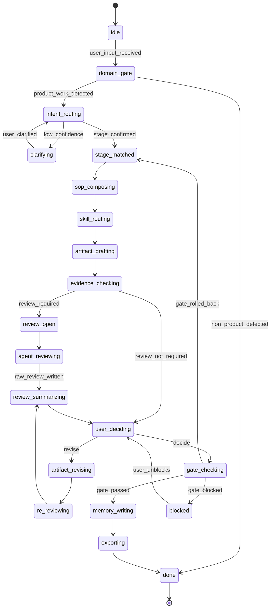

# Workflow State Machine / 工作流状态机

本文件定义 Product Crew OS 的真实运行节点、状态转移和可视化方式。它和 `workflow-orchestration-policy.md` 配套使用。

当前实现覆盖边界见 `workflow-implementation-coverage-v0.md`。本文件定义目标状态机和通用节点，不代表 10 个主流程、44 个 SOP 都已经具备完整 Golden Case。

## 1. 三层可视化

### 1.1 用户前台状态卡

给普通用户看：

```text
现在在判断什么
这轮会交付什么
这轮不承诺什么
当前关键风险
谁来把关
你需要拍什么板
你可以如何纠偏
```

### 1.2 后台状态机

给主控教练、开发者、测试和审计者看：

```text
用户输入
-> 领域/意图判定
-> 主流程命中
-> Stage 命中
-> SOP 组合
-> Skill 调用
-> Artifact 生成
-> 证据检查
-> 子 Agent 评审
-> Review Items
-> 用户决策
-> Gate 判断
-> 下一阶段 / 回退 / 暂停
```

### 1.3 Runtime Trace

给机器回放、回归测试和仪表盘看：

```yaml
input_id:
main_flow_id:
stage_id:
sop_ids:
skill_router_log:
artifact_id:
context_packet_refs:
invocation_ledger:
raw_review_records:
review_items:
user_decisions:
gate_status:
next_state:
```

## 2. 状态定义

| 状态 | 含义 | 必要输出 |
| --- | --- | --- |
| `idle` | 等待用户输入 | 无 |
| `domain_gate` | 判断是否进入 Product Crew OS | product / non-product |
| `intent_routing` | 识别用户意图和主流程候选 | candidates + confidence |
| `stage_matched` | 命中 canonical stage | `stage_id` |
| `clarifying` | 低置信度或多意图，需要澄清 | clarification question |
| `sop_composing` | 组合 1-3 个 SOP | `sop_ids` + reasons |
| `skill_routing` | 选择 primary/fallback skill | `skill_router_log` |
| `artifact_drafting` | 生成或修改 artifact | `artifact_id` + version |
| `evidence_checking` | 区分事实、假设、缺失证据 | evidence readiness |
| `review_open` | 打开结构化评审 | review session |
| `agent_reviewing` | 角色独立评审 | context packet + invocation |
| `review_summarizing` | 主控收束评审项 | must-fix / conflict / open questions |
| `user_deciding` | 等待用户采纳、拒绝、暂缓或补证据 | user decision |
| `artifact_revising` | 根据用户决策修订产物 | artifact diff |
| `re_reviewing` | 只召回受影响角色复评 | re-review packet |
| `gate_checking` | 阶段门判断 | pass / conditional / block / rollback |
| `memory_writing` | 写入项目记忆和事件 | runtime + workspace |
| `exporting` | 可选镜像到 Obsidian / Markdown | export manifest |
| `done` | 本轮完成 | next action |
| `blocked` | 有未解 blocker | blocker list |
| `paused` | 用户暂停 | resume condition |

## 3. 事件定义

| 事件 | 来源 | 目标 |
| --- | --- | --- |
| `user_input_received` | 用户 | 进入 `domain_gate` |
| `non_product_detected` | Domain Gate | 退出工作流 |
| `product_work_detected` | Domain Gate | 进入 `intent_routing` |
| `low_confidence` | Router | 进入 `clarifying` |
| `stage_confirmed` | Router / 用户纠偏 | 进入 `sop_composing` |
| `sop_plan_ready` | SOP Composer | 进入 `skill_routing` |
| `skill_ready` | Skill Router | 进入 `artifact_drafting` |
| `artifact_ready` | Artifact Writer | 进入 `evidence_checking` |
| `review_required` | Gate / 用户 / 风险 | 进入 `review_open` |
| `review_not_required` | Gate / 风险低 | 进入 `user_deciding` 或 `gate_checking` |
| `raw_review_written` | Review Loop | 进入 `review_summarizing` |
| `user_decision_received` | 用户 | 进入 `artifact_revising` / `gate_checking` |
| `artifact_revised` | Artifact Writer | 进入 `re_reviewing` |
| `gate_passed` | Gate | 进入 `memory_writing` |
| `gate_blocked` | Gate | 进入 `blocked` |
| `gate_rolled_back` | Gate | 回到相应 stage |
| `memory_written` | Runtime | 进入 `exporting` 或 `done` |

## 4. Mermaid 状态机



## 5. Obsidian 使用方式

Obsidian 可以直接渲染本文件中的 Mermaid 图。

推荐 Vault 中建立：

```text
Product Crew OS/
  00_状态机总览.md
  01_用户前台状态卡.md
  02_后台运行 Trace.md
  03_Golden Case 回归.md
```

Project Workspace 仍是事实源；Obsidian 只是阅读和可视化入口。

## 6. 当前实现边界

截至 `2026-07-09`：

- 44 个 SOP 已具备 SOP 卡片、Skill Router、Prompt Eval 和 Runtime Smoke。
- 只有 `flow_01_opportunity_discovery_pass` 是完整 Golden Case。
- 后续 `solution_design`、`prd_drafting`、`cross_functional_review`、`delivery_planning`、`launch_readiness`、`post_launch_review` 仍是 partial / missing。
- 不能把 `run-release-gate.py` 的 44/44 Stage/SOP 路由结果，等同于 44/44 完整业务工作流状态机。

覆盖矩阵见：

- `workflow-implementation-coverage-v0.md`
- `workflow-implementation-coverage-v0.yaml`
